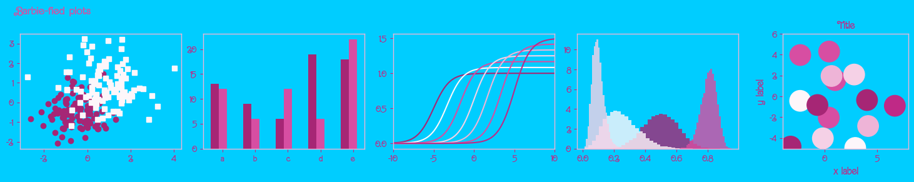

# barbie-matplotlib

A Barbie style for matplotlib, inspired by [theme_barbie.R](https://github.com/MatthewBJane/theme_park/blob/main/theme_barbie.R)

## Usage

1. Create a virtual environment with matplotlib and numpy (optional)
2. Run [barbie_style_demo.py](./barbie_style_demo.py) to see the Barbie style in action
3. To use in your own code:
    - Download the .mplstyle file and put it in your project directory
    - Use `with plt.style.context('barbie.mplstyle'):` when plotting

## To Do

    - Make usage easier: https://matplotlib.org/stable/users/explain/customizing.html#distributing-styles

## Sources

- barbie.py: Adapted from [the matplotlib style sheets reference](https://matplotlib.org/stable/gallery/style_sheets/style_sheets_reference.html)
- barbie.mplstyle: Adapted from the minimalist template in [this Medium article](https://towardsdatascience.com/how-to-create-and-use-custom-matplotlib-style-sheet-9393f498063#:~:text=Build%20Custom%20.mplstyle%20File) and parts of various stylesheets located in the [matplotlib source code](https://github.com/matplotlib/matplotlib/tree/main/lib/matplotlib/mpl-data/stylelib)
- barbie.ttf: Font can be downloaded from [this website](https://freefontsvault.com/barbie-font/)